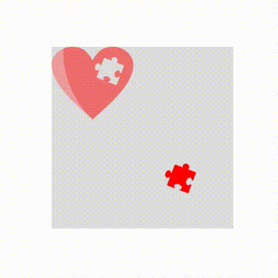
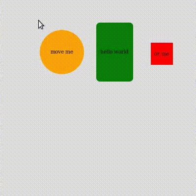

# panzoom-core
Library for pan and zoom with possibility to moving and selecting elements inside.



# Demo
...

# Installation
```npm install panzoom-core```

# Options

| Name | | Default | Description |
| --- | --- | --- | --- |
| boundary | { top, right, bottom left, parent } `\|` bool | false | **top, right, bottom, left** - numbers in px.<br />can be used as expression like: <br />`{ top: 'childHeight - containerHeight - 100px' }`
| disabledUserSelect | bool | false | prevent css select as text etc |
| disabled | bool | false | disabling pan and zoom |
| disabledElements | bool | false | disabling moving elements |
| disabledMove | bool | false | disabling move |
| disabledZoom | bool | false | disabling zoom |
| height | string/number | 100% | height of child container |
| onContainerChange | func | null | event on move/zoom |
| onContainerClick | func | null | event on mousedown/touchdown |
| onContainerPositionChange | func | null | event on position change |
| onContainerZoomChange | func | null | event on zoom change |
| onElementsChange | func | null | callback invoked when elements change position |
| selecting | bool | false | switches to selecting mode, see `selecting` |
| width | string/number | 100% | width of child container |
| zoomInitial | number | 1 | initial zoom value |
| zoomMax | number | 5 | maximum zoom |
| zoomMin | number | 0.3 | minimum zoom |
| zoomSpeed | number | 1 | zoom speed on wheel event |

# API
```tsx
import initializePanZoom from 'panzoom-core'

const node = document.querySelector('[data-id="panzoom"]')
const panZoom = initializePanZoom(node, options)
```
```html
<div>
  <div data-id="panzoom"> </div>
</div>
```

panZoom contains methods like:

| Function | Description |
| --- | --- |
| setOptions(options) | Setting options for panzoom |
| addElement(node: **HTMLDivElement**, elementOptions: **ElementOptions**) => **ElementApi** | Adding new element to moving |
| move(x:**number**, y:**number**) | Add x and y in px to current offset. Returns current position {x, y} |
| getElements() | Returns map of elements |
| getPosition() | Returns current position {x, y} |
| setPosition(x:**number**, y:**number**) | Set offset position of pan |
| getZoom():**number** | Returns current zoom |
| setZoom(zoom:**number**) | Sets zoom |
| zoomIn(zoom:**number**) | Add to current zoom, could be also negative number (it will work like zoomOut) |
| zoomOut(zoom:**number**) | Sub from current zoom |
| childNode | Returns passed node |
| reset() | Reset to (0, 0, 0) |
| destroy() | Unmounting panzoom element |

# Elements


```tsx
import initializePanZoom from 'panzoom-core'

const node = document.querySelector('[data-id="panzoom"]')
const panZoom = initializePanZoom(node, options)

const elementA = panZoom.addElement(
  document.querySelector('[data-id="element-a"]'),
)
const elementB = panZoom.addElement(
  document.querySelector('[data-id="element-b"]'),
  { x: 100, y: 100 },
)
```
```html
<div>
  <div data-id="panzoom">
    <div data-id="element-a">test</div>
    <div data-id="element-b">move me</div>
  </div>
</div>
```

## Element properties

| Name | | Default | Description |
| --- | --- | --- | --- |
| id * | string/id | undefined | Unique ID of element |
| className | string | undefined | Class name for element |
| disabled | bool  | false | Disabling element |
| draggableSelector | string | undefined | Selector for dragging element |
| family | string | undefined | Name of element's family, all of elements are connected during moving |
| followers | Array\<string/id\> | [] | Similar to family, but for specified ids of elements |
| onClick | func | null | Event on element's click |
| onMouseUp | func | null | Event on element's mouse up |
| x | number  | 0 | x position of element |
| y | number  | 0 | y position of element |

__*__ - is required

# Selecting

```tsx
import initializePanZoom from 'panzoom-core'

// ...
const panZoom = initializePanZoom(node, { selecting: true })

// to disable:
panZoom.setOptions({ selecting: false })
```



# Testing
```
npm run test
```

# Examples
```
npm run dev
```
